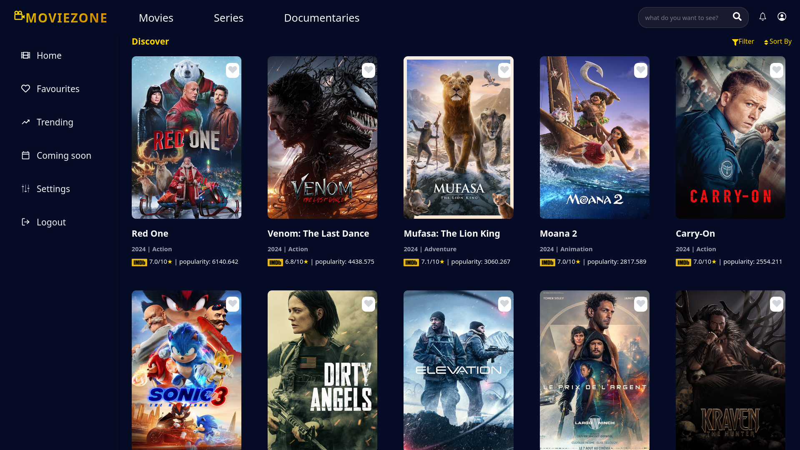

# Projet Movies React


*The main homepage displaying trending content.*

This is a React-based web application that uses **TMDB API (Version 3)** to explore, search, and display detailed information about movies, TV shows, and their respective genres. The app provides a dynamic and responsive interface to enhance the user experience.

## Table of Contents

- [Projet Movies React](#projet-movies-react)
  - [Table of Contents](#table-of-contents)
  - [Features](#features)
  - [Setup and Installation](#setup-and-installation)
  - [Usage](#usage)
  - [API Documentation](#api-documentation)
    - [Key Endpoints Used:](#key-endpoints-used)

## Features

- **Search Functionality**: Search for movies and TV shows by title.
- **Trending Content**: View trending movies and TV shows updated daily or weekly.
- **Genres**: Filter movies and shows by genre.
- **Detailed View**: Access detailed information, including synopsis, ratings and production companies info card.
- **Favorites**: Add movies or shows to a personalized favorites list.

## Setup and Installation

1. Clone the repository:
   ```bash
   git clone https://github.com/tahatahereddine/MovieZone.git
   cd MovieZone
   ```

2. Install dependencies:
   ```bash
   npm i
   ```

3. Create an `.env` file in the root directory and add your TMDB API key:
   ```env
   VITE_API_KEY=your_tmdb_api_key_here
   ```

4. Start the development server:
   ```bash
   npm run dev
   ```

5. Open [http://localhost:5173](http://localhost:5173) to view the app in the browser.

## Usage

- Search for movies or TV shows using the search bar.
- Explore trending content on the homepage.
- Click on a movie or show card to view detailed information.
- Use genre filters or soting options to refine your search.
- Add items to your favorites for quick access.

## API Documentation

This project uses **TMDB API (Version 3)**. Refer to the official TMDB documentation for more details:
[TMDB API Documentation](https://developer.themoviedb.org/docs/getting-started)

### Key Endpoints Used:
- `/movie/popular`
- `/tv/popular`
- `/search/movie`
- `/search/tv`
- `/genre/movie/list`
- `/genre/tv/list`
